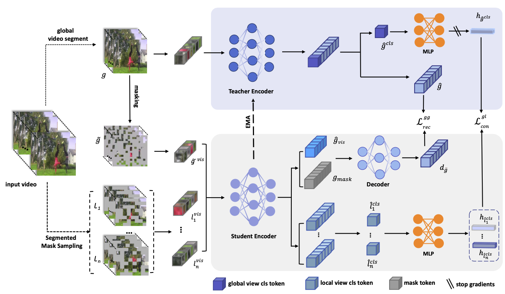

# Boosting Representation Diversity in Video Transformers via Segmented Contrastive Masked Autoencoders


> **Abstract**: In self-supervised representation learning, contrastive learning leverages data invariance to identify global patterns, but its lack of local constraints often yields video representations overly focused on global content, limiting feature diversity. To address this, we propose Segmented Contrastive Masked Autoencoders (SCMA), a novel framework that synergizes contrastive learning with masked autoencoders via teacher-student self-distillation. SCMA enhances the contrastive learning's capability in modeling local details of videos, effectively improving the diversity of video representations learned by ViT models. Furthermore, we introduce a segmented mask sampling strategy to partition videos uniformly and apply adaptive masking, enhancing training efficiency and input variation robustness. Experimental results show that SCMA achieves superior top-1 accuracy on a range of video action recognition benchmarks under both fine-tuning and linear probing settings, and further shows strong capabilities in video object segmentation.

 
*Figure 1: Overall architecture of SCMA. Global views were generated by uniformly sampling frames from the entire video and were fed into the teacher network to produce global features. Segmented mask sampling was applied to the same video to generate n local views, which were then fed into a student network to extract the local features of the video. An alignment constraint (contrastive learning) aligned these local features with global features to capture the global motion information of the video. Visible patches from the global masked views were input into the student network. The output features, along with the masked tokens, were fed into a decoder to reconstruct the output of the teacher network, enabling the learning of the token-level local correlation information.*

---
## 🚀 Getting Started

### Prerequisites

Ensure that the following dependencies are installed in your environment:

- Python >= 3.8
- Mindspore >= 1.19


---

## 🏃 Pre-training

Start pre-training the SCMA model using the following command.

```bash
bash script/pretrain.sh
```

## 🏃 Fine-tuning

Start fine-tuning the SCMA model using the following command.

```bash
bash script/finetune.sh
```